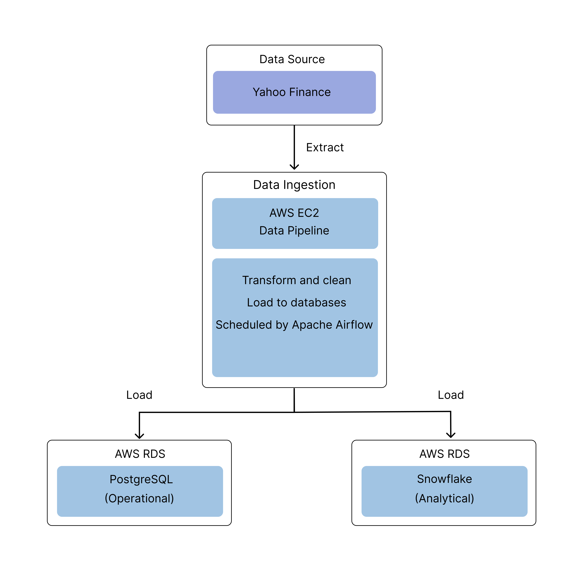

# Stock Market Data Pipeline
This project is an automated end to end pipeline that collects daily stock market data from Yahoo Finance and stores it for stock analysis. This allows users to analyze and track stock price performance, identify trends, and calculate technical indicators like moving averages across multiple stocks over time

## Data Architecture
 

## Tech Stack

- Python
- SQL
- Pandas
- AWS RDS (PostgreSQL)
- Snowflake
- Apache Airflow
- AWS EC2 

## Stocks Tracked

Currently configured to track these US stocks:
> [!NOTE]
> Stocks can be configure via config.json

- AAPL - Apple Inc.
- GOOGL - Alphabet Inc.
- AMZN - Amazon.com, Inc.
- MSFT - Microsoft Corporation
- TSLA - Tesla, Inc.

